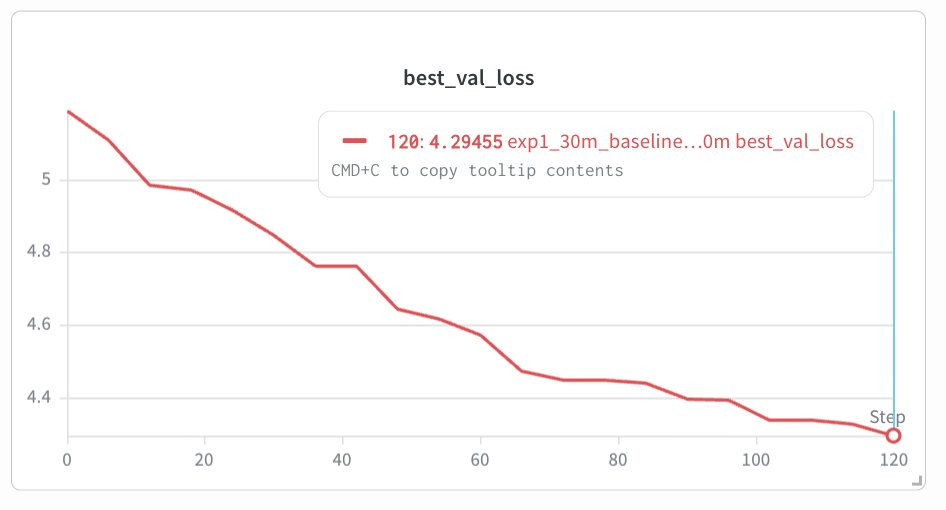
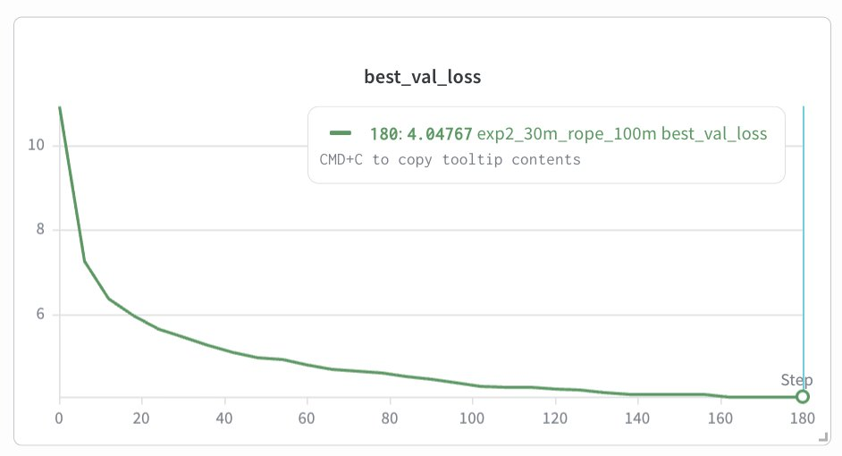

# nanogpt-hack

Small nanoGPT-style pretraining experiments on a 100M-token mixed Hugging Face dataset, with controlled ablations for RoPE, `torch.compile`, and Muon.

## What This Is

This repo is a small pretraining playground inspired by nanoGPT. I used nanoGPT as the baseline style, then built a separate experiment setup to understand dataset preparation, training configs, checkpointing, WandB logging, and controlled ablations.

The goal was not to train a large model. The goal was to learn the pretraining loop end to end.

## Dataset

I moved from toy data to a 100M-token mixed Hugging Face dataset:

- 70% FineWeb-Edu
- 20% Cosmopedia
- 10% Python code

I picked this mix to make the data feel closer to modern pretraining: general web/education text, explanation-style synthetic data, and some code.

## Experiments

All main experiments used the same approximate setup:

- Decoder-only Transformer
- ~30M parameter scale
- 100M token budget
- GPT-2 BPE tokenization
- bf16 training on MI300X
- WandB logging
- checkpointing enabled

## Results

| Experiment | Change | Best Val Loss | Throughput |
|---|---|---:|---:|
| Exp 1B | Learned absolute positional embeddings + AdamW | 4.29455 | ~480k tok/s |
| Exp 2 | RoPE + AdamW | 4.04767 | ~407k tok/s |
| Exp 3A | RoPE + `torch.compile=True` | Failed | N/A |
| Exp 3B | RoPE + Muon/AdamW hybrid | 4.47715 | ~385k tok/s |

Best result: **RoPE + AdamW**.

## Baseline

## RoPE

## Main Learning

RoPE improved validation loss under the same training budget, but added some overhead in attention. The clean ablation was:

- learned absolute positional embeddings disabled/bypassed
- RoPE applied to `q` and `k`
- dataset, model size, optimizer, token budget, and eval setup kept the same

The biggest takeaway: good experiments come from changing one thing at a time and comparing under the same token budget.

## Files

- `src/model.py` - nanoGPT-style model with optional RoPE
- `src/train.py` - fixed-token training loop
- `src/optimizers.py` - AdamW and Muon/AdamW hybrid optimizer support
- `configs/` - experiment configs
- `experiment_log.md` - full experiment notes and results
